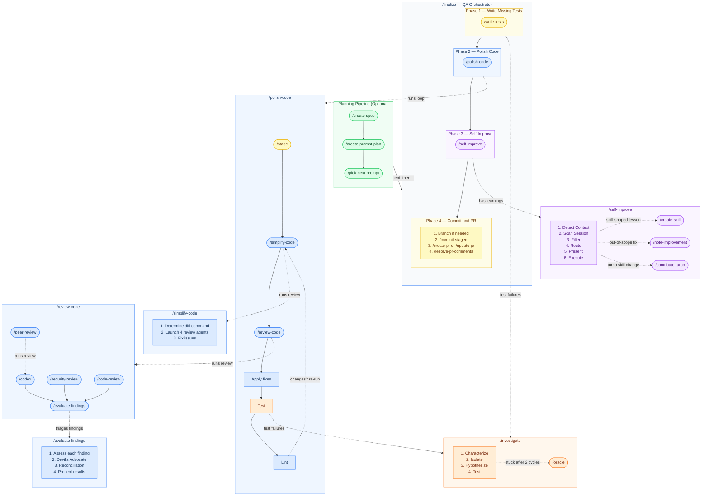

# Turbo

A composable dev process for [Claude Code](https://docs.anthropic.com/en/docs/claude-code), packaged as modular skills. Each skill encodes a dev workflow so you can run it instead of prompting from scratch. Battle-tested with the Opus model.

**TL;DR** — Three steps to ship:

1. **Plan** — Enter plan mode and describe what you want to build
2. **Implement** — Build it with Claude
3. **Run `/finalize`** — Tests, iterative code polishing, commit, and PR. One command.

Everything else in Turbo builds on this loop: planning pipelines for large projects, debugging tools for when things break, and self-improvement that makes each session teach the next. There are 40+ skills beyond `/finalize`. Read on for the full picture.

## What Is This?

Turbo covers the full dev lifecycle: reviewing code, creating PRs, investigating bugs, self-improving from session learnings, and more.

Five ideas shape the design:

1. **Standardized process.** Skills capture dev workflows so you can run them directly instead of prompting from scratch. [`/finalize`](#the-main-workflow) runs your entire post-implementation QA in one command. `/investigate` follows a structured root cause analysis cycle. The skill is the prompt.
2. **Layered design.** Skills range from focused tools (`/code-review` analyzes a diff) to orchestrators that compose them (`/review-code` chains code review, peer review, security review, API usage review, and evaluation; `/polish-code` loops simplify → review → test → lint until stable). They [work together](#how-skills-connect) with a natural, predictable interface.
3. **Swappable by design.** Every skill owns one concern and communicates through standard interfaces. Replace any piece with your own and the pipeline adapts. See [The Puzzle Piece Philosophy](#the-puzzle-piece-philosophy) for details.
4. **Works out of the box.** Install the skills and the full workflow is ready. Dependencies are standard dev tooling (GitHub CLI, Codex) that most teams already have.
5. **Just skills.** No framework, no custom runtime, no new memory system. Skills are plain markdown that use Claude Code's native primitives (git, filesystem, built-in tools). Remove an independent skill and the rest still work.

The other core piece is [`/self-improve`](#self-improvement), which makes the whole system compound. After each session, it extracts lessons from the conversation and routes them to the right place: project CLAUDE.md, auto memory, or existing/new skills. Every session teaches Claude something, and future sessions benefit.

## How Skills Connect

This diagram shows how `/finalize` orchestrates its pipeline and how the key sub-skills compose. It covers the core workflow, not every skill in Turbo. See [All Skills](#all-skills) for the full list.



## Works Best With

Turbo amplifies your existing process. It shines when your project has the right infrastructure in place:

- **Tests** — `/finalize` runs your test suite and writes missing tests. Without tests, there's no safety net. If your project doesn't have automated tests, [`/smoke-test`](#all-skills) (standalone skill, not part of `/finalize`) can fill the gap by launching your app and verifying changes manually, but real tests are always better.
- **Linters and formatters** — `/finalize` runs your linter after code review fixes. If you don't have one, style issues slip through.
- **Dead code analysis** — [`/find-dead-code`](#all-skills) (standalone skill, not part of `/finalize`) identifies unused code via parallel analysis, but it's even better when your project already has tools like `knip`, `vulture`, or `periphery` integrated.
- **Dependencies** — [GitHub CLI](https://cli.github.com/) and [Codex CLI](https://github.com/openai/codex) power PR operations and peer review. Everything works without them, but the full pipeline is better with them. See [Prerequisites](#5-install-prerequisites) for setup.

## Who It's For

The target audience is experienced developers who want to move faster without sacrificing quality. That said, beginners are welcome too. Turbo is a great way to learn how a professional dev workflow looks. Just don't blindly trust outputs. Review what Claude produces, understand *why* it made those choices, and build your own judgment alongside it.

If your plan is vague, your architecture is unclear, and you skip every review finding, Turbo won't save you. Garbage in, garbage out.

## The Puzzle Piece Philosophy

Every skill is a self-contained piece. Orchestrator skills like `/finalize` compose them into workflows, but each piece works independently too.

Want to swap a piece? For example:
- Replace `/oracle` with your own setup (it's macOS-only and has a cookies workaround)
- Replace `/commit-rules` with your team's commit convention. The pipeline adapts.
- Replace `/code-style` with your team's style guide. The built-in one teaches general principles rather than opinionated rules, so it's a natural swap point.

This is also why similar-sounding skills like `/code-review` and `/review-code` both exist. `/code-review` analyzes a diff and returns structured findings. `/review-code` is an orchestrator that composes `/code-review`, `/peer-review`, `/security-review`, and `/api-usage-review` into a full pipeline with evaluation. Run the piece when you want a scan. Run the orchestrator when you want the whole review.

Skills communicate through standard interfaces: git staging area, PR state, and file conventions.

## Sponsorship

If Turbo has helped you ship faster and you're so inclined, I'd greatly appreciate it if you'd consider [sponsoring my open source work](https://github.com/sponsors/tobihagemann).


## Quick Start

### Prerequisites

Turbo requires [Claude Code](https://docs.anthropic.com/en/docs/claude-code). Works best with Claude Code Max 5x, Max 20x, or Team plan with Premium seats (orchestrator workflows are context-heavy). Additional tools are installed during setup (steps [5](#5-install-prerequisites) and [6](#6-install-companion-skills-recommended)).

**External services:** ChatGPT Plus or higher (for codex review), and ChatGPT Pro or Business (for `/oracle`, where Pro models are the only ones that reliably solve very hard problems). That said, `/peer-review` and `/oracle` are designed as swappable puzzle pieces, so if you don't have access, replace them with alternatives that work for you.

### Automatic Setup (Recommended)

Open Claude Code and prompt:

```
Walk me through the Turbo setup. Read SETUP.md from the tobihagemann/turbo repo and guide me through each step.
```

Claude will clone the repo, copy the skills, configure your environment, and walk you through each step interactively.

### Updating

Run `/update-turbo` in Claude Code to update all skills. It fetches the latest update instructions from GitHub, builds a changelog, handles conflict detection for customized skills, and manages exclusions.

### Manual Setup

See [SETUP.md](SETUP.md) for the full guide, or follow the steps below.

#### 1. Clone the Repo

Clone (or fork) the Turbo repo to `~/.turbo/repo/`:

```bash
git clone https://github.com/tobihagemann/turbo.git ~/.turbo/repo
```

To contribute improvements back, fork the repo on GitHub first, then clone your fork and add the upstream remote:

```bash
git clone https://github.com/<your-username>/turbo.git ~/.turbo/repo
cd ~/.turbo/repo && git remote add upstream https://github.com/tobihagemann/turbo.git
```

#### 2. Copy Skills

Copy all skill directories to your global skills location:

```bash
for skill in $(ls ~/.turbo/repo/skills/); do
  cp -r ~/.turbo/repo/skills/$skill ~/.claude/skills/$skill
done
```

Many skills depend on each other (e.g., `/finalize` orchestrates `/simplify-code`, `/peer-review`, `/evaluate-findings`, and more), so installing only a subset will leave gaps in the workflows.

#### 3. Initialize Config

Create `~/.turbo/config.json`:

```bash
mkdir -p ~/.turbo
cat > ~/.turbo/config.json << EOF
{
  "repoMode": "clone",
  "excludeSkills": [],
  "lastUpdateHead": "$(git -C ~/.turbo/repo rev-parse HEAD)",
  "configVersion": 1
}
EOF
```

Set `repoMode` to `"clone"` (consumer), `"fork"` (contributor), or `"source"` (maintainer).

#### 4. Add `.turbo` to Global Gitignore

Some skills store project-level files in a `.turbo/` directory (specs, prompt plans, improvements). Add it to your global gitignore to keep project repos clean:

```bash
mkdir -p ~/.config/git
echo '.turbo/' >> ~/.config/git/ignore
```

This uses Git's standard XDG path (`$XDG_CONFIG_HOME/git/ignore`), which Git reads automatically without needing `core.excludesfile`. If `core.excludesfile` is already set, add `.turbo/` to that file instead.

#### 5. Install Prerequisites

[GitHub CLI](https://cli.github.com/) is used by many skills for PR operations, review comments, and repo queries:

```bash
brew install gh
gh auth login
```

[Codex CLI](https://github.com/openai/codex) is used by `/peer-review` for AI-powered code review during `/finalize`. Requires ChatGPT Plus or higher:

```bash
npm install -g @openai/codex
```

#### 6. Install Companion Skills (Recommended)

The `/smoke-test` skill uses external skills for browser and UI automation:

| Skill | What it's for | Install |
|---|---|---|
| [agent-browser](https://github.com/vercel-labs/agent-browser) | Browser automation for web app smoke testing (highly recommended) | `npx skills add https://github.com/vercel-labs/agent-browser --skill agent-browser --agent claude-code -y -g` |
| [peekaboo](https://github.com/openclaw/openclaw) | macOS UI automation for native app smoke testing | `npx skills add https://github.com/openclaw/openclaw --skill peekaboo --agent claude-code -y -g` |

Without these, `/smoke-test` falls back to terminal-based verification.

#### 7. Allow All Skills

Orchestrator workflows like `/finalize` invoke many skills in sequence. Without allowlisting them, you'll get prompted for each one, breaking the flow.

Add all Turbo skills to the `permissions.allow` array in `~/.claude/settings.json`. Generate the entries from the local repo:

```bash
ls ~/.turbo/repo/skills/ | sed 's/.*/"Skill(&)"/'
```

Merge the output into your existing `permissions.allow` array.

#### 8. Configure Context Tracking

Turbo workflows like `/finalize` consume significant context. Knowing how much context you have left prevents unexpected compaction mid-workflow.

Add this to `~/.claude/settings.json`:

```json
{
  "statusLine": {
    "type": "command",
    "command": "jq -r '\"\\(.context_window.remaining_percentage | floor)% context left\"'"
  }
}
```

#### 9. Add Pre-Implementation Prep

Add this to your `~/.claude/CLAUDE.md` (create the file if it doesn't exist):

```markdown
# Pre-Implementation Prep

After plan approval (ExitPlanMode) and before making edits:
1. Run `/code-style` to load code style principles
2. Read all files referenced by the user in their request
3. Read all files mentioned in the plan
4. Read similar files in the project to mirror their style
```

#### 10. Disable Auto-Compact (Optional)

With the 1M context window, compaction is rarely needed. If you prefer to control compaction timing, disable auto-compact in Claude Code via `/config`.

#### 11. Oracle Setup (Optional)

The `/oracle` skill requires additional setup (Chrome, Python, ChatGPT access). See the [oracle skill](skills/oracle/SKILL.md) for configuration via `~/.turbo/config.json`. If not set up, everything still works.

## The Main Workflow

The recommended way to use Turbo:

1. **Enter plan mode** and plan the implementation
2. **Approve the plan**
3. **Run `/finalize`** when you're done implementing

`/finalize` runs through these phases automatically:

1. **Write Missing Tests** — Analyze changes and write tests matching project conventions
2. **Polish Code** — Iterative loop: stage → simplify → review + fix → test → lint → re-run until stable
3. **Self-Improve** — Extract learnings, route to CLAUDE.md / memory / skills
4. **Commit and PR** — Branch if needed, commit, push, create or update PR

### Context Management Tips

With the 1M context window, running out of context during `/finalize` is unlikely for most sessions. If you do hit the limit on very long sessions:

- **Run `/self-improve` before `/compact`.** Compaction loses conversational detail that `/self-improve` mines for lessons. Capture learnings first, then compact.
- The status line from step 6 above makes remaining context easy to track.

### Self-Improvement

`/self-improve` is another core skill. Run it anytime before your context runs out (it's also part of `/finalize` Phase 4). It scans the conversation for corrections, repeated guidance, failure modes, and preferences, then routes each lesson to the right place: project CLAUDE.md, auto memory, or existing/new skills. It routes lessons through Claude Code's built-in knowledge layers and, over time, makes Claude better at your specific project.

`/note-improvement` captures improvement opportunities that come up during work but are out of scope: code review findings you chose to skip, refactoring ideas, missing tests. These get tracked in `.turbo/improvements.md` so they don't get lost. Since `.turbo/` is gitignored, it doesn't clutter the repo. When you're ready to act on them, `/implement-improvements` validates each entry against the current codebase (filtering out stale items), then plans and implements the remaining ones.

## The Planning Pipeline (Optional)

For larger projects, Turbo offers a full spec-to-implementation pipeline. You can skip this entirely and jump straight to implementation + `/finalize`.

1. **Run `/create-spec`** — Guided discussion that produces a spec at `.turbo/spec.md`
2. **Run `/create-prompt-plan`** — Breaks the spec into context-sized prompts at `.turbo/prompts.md`
3. **For each prompt, open a new session:** enter plan mode and run `/pick-next-prompt`, then approve the plan

`/pick-next-prompt` uses `/plan-style`, which includes implementation and `/finalize` in the plan.

Each session handles one prompt to keep context focused.

## All Skills

### Orchestrators

| Skill | What it does | Uses |
|---|---|---|
| [`/finalize`](skills/finalize/SKILL.md) | Post-implementation QA: test, polish, commit, PR | `/write-tests`, `/polish-code`, `/self-improve`, `/commit-staged`, `/create-pr`, `/update-pr`, `/resolve-pr-comments` |
| [`/polish-code`](skills/polish-code/SKILL.md) | Iterative quality loop: stage → simplify → review + fix → test → lint → re-run until stable | `/stage`, `/simplify-code`, `/review-code`, `/investigate` |
| [`/review-pr`](skills/review-pr/SKILL.md) | PR review: fetch comments, detect base branch, run code review | `/fetch-pr-comments`, `/review-code` |

### Planning

| Skill | What it does | Uses |
|---|---|---|
| [`/create-spec`](skills/create-spec/SKILL.md) | Guided discussion that produces a spec at `.turbo/spec.md` | |
| [`/create-threat-model`](skills/create-threat-model/SKILL.md) | Analyze a codebase and produce a threat model at `.turbo/threat-model.md` | |
| [`/create-prompt-plan`](skills/create-prompt-plan/SKILL.md) | Break a spec into context-sized implementation prompts | `/evaluate-findings` |
| [`/pick-next-prompt`](skills/pick-next-prompt/SKILL.md) | Pick the next prompt from `.turbo/prompts.md` and plan it | `/plan-style` |
| [`/pick-next-issue`](skills/pick-next-issue/SKILL.md) | Pick the most popular open GitHub issue and plan it | `/plan-style` |
| [`/plan-style`](skills/plan-style/SKILL.md) | Planning conventions for task tracking, skill loading, and finalization | |
| [`/capture-context`](skills/capture-context/SKILL.md) | Capture session knowledge into the plan file before clearing context | |

### Code Quality

| Skill | What it does | Uses |
|---|---|---|
| [`/code-style`](skills/code-style/SKILL.md) | Enforce mirror, reuse, and symmetry principles | |
| [`/write-tests`](skills/write-tests/SKILL.md) | Write missing tests matching project conventions | `/investigate` |
| [`/simplify-code`](skills/simplify-code/SKILL.md) | Multi-agent review for reuse, quality, efficiency, clarity | |
| [`/review-code`](skills/review-code/SKILL.md) | AI code review: 4 parallel reviewers + evaluation | `/code-review`, `/peer-review`, `/security-review`, `/api-usage-review`, `/evaluate-findings` |
| [`/code-review`](skills/code-review/SKILL.md) | AI code review analysis with structured findings | |
| [`/security-review`](skills/security-review/SKILL.md) | Security-focused code review with threat model integration | |
| [`/peer-review`](skills/peer-review/SKILL.md) | AI code review interface that delegates to `/codex` by default | `/codex` |
| [`/api-usage-review`](skills/api-usage-review/SKILL.md) | Check API/library usage against official documentation | |
| [`/codex`](skills/codex/SKILL.md) | AI code review and task execution via codex CLI | |
| [`/evaluate-findings`](skills/evaluate-findings/SKILL.md) | Confidence-based triage of review feedback | |
| [`/find-dead-code`](skills/find-dead-code/SKILL.md) | Identify unused code via parallel analysis | `/evaluate-findings`, `/investigate` |

### Git & GitHub

| Skill | What it does | Uses |
|---|---|---|
| [`/stage`](skills/stage/SKILL.md) | Stage implementation changes with precise file selection | |
| [`/stage-commit`](skills/stage-commit/SKILL.md) | Stage files and commit in one step | `/stage`, `/commit-staged` |
| [`/stage-commit-push`](skills/stage-commit-push/SKILL.md) | Stage, commit, and push in one step | `/stage-commit` |
| [`/commit-staged`](skills/commit-staged/SKILL.md) | Commit already-staged files with good message | `/commit-rules` |
| [`/commit-staged-push`](skills/commit-staged-push/SKILL.md) | Commit already-staged files and push | `/commit-staged` |
| [`/commit-rules`](skills/commit-rules/SKILL.md) | Shared commit message rules and technical constraints | |
| [`/create-pr`](skills/create-pr/SKILL.md) | Draft and create a GitHub PR | `/github-voice` |
| [`/update-pr`](skills/update-pr/SKILL.md) | Update existing PR title and description | `/github-voice` |
| [`/fetch-pr-comments`](skills/fetch-pr-comments/SKILL.md) | Read-only summary of unresolved PR comments | |
| [`/resolve-pr-comments`](skills/resolve-pr-comments/SKILL.md) | Evaluate, fix, and reply to PR comments | `/evaluate-findings`, `/self-improve`, `/stage-commit-push`, `/github-voice` |

### Debugging

| Skill | What it does | Uses |
|---|---|---|
| [`/investigate`](skills/investigate/SKILL.md) | Systematic root cause analysis for bugs and failures | `/codex`, `/evaluate-findings`, `/oracle` |
| [`/smoke-test`](skills/smoke-test/SKILL.md) | Launch the app and verify changes manually | `/investigate` |
| [`/oracle`](skills/oracle/SKILL.md) | Consult ChatGPT when completely stuck (requires setup) | |

### Knowledge & Maintenance

| Skill | What it does | Uses |
|---|---|---|
| [`/self-improve`](skills/self-improve/SKILL.md) | Extract session learnings to CLAUDE.md, memory, or skills | |
| [`/note-improvement`](skills/note-improvement/SKILL.md) | Capture out-of-scope improvement ideas to `.turbo/improvements.md` | |
| [`/implement-improvements`](skills/implement-improvements/SKILL.md) | Validate and implement improvements from the backlog | `/plan-style` |
| [`/create-skill`](skills/create-skill/SKILL.md) | Create or update a skill with proper structure | |
| [`/tidy-memory`](skills/tidy-memory/SKILL.md) | Audit and clean up auto-memory when it grows too large | |
| [`/update-deps`](skills/update-deps/SKILL.md) | Smart dependency upgrades with breaking change research | |
| [`/update-turbo`](skills/update-turbo/SKILL.md) | Update Turbo skills with always-latest instructions fetched from GitHub | |
| [`/contribute-turbo`](skills/contribute-turbo/SKILL.md) | Submit turbo skill improvements back to upstream | `/commit-rules`, `/github-voice` |

## License

Distributed under the MIT License. See the [LICENSE](LICENSE) file for details.
