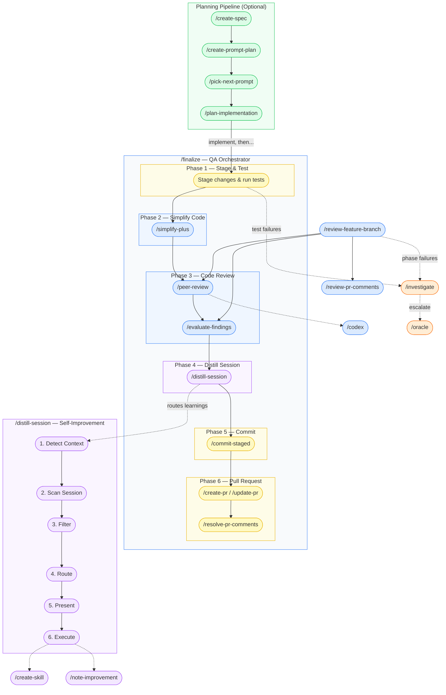

# Turbo

A modular collection of [Claude Code](https://docs.anthropic.com/en/docs/claude-code) skills that speed up everyday dev tasks while keeping quality high. Heavily optimized and battle-tested with Claude Code and the Opus model.

## What Is This?

Turbo is a skill set for Claude Code. Each skill teaches Claude a specific workflow: reviewing code, creating PRs, investigating bugs, distilling session learnings, and more. The skills are designed to [work together](#how-skills-connect).

The key idea: skills aren't just standalone tools you use next to each other. They're [puzzle pieces](#the-puzzle-piece-philosophy) that connect into larger workflows. The main orchestrator, [`/finalize`](#the-main-workflow), chains testing, code simplification, AI review, committing, and PR creation into one command. But each piece is small and swappable. Replace one skill with your own and the rest of the pipeline still works.

The other core piece is [`/distill-session`](#self-improvement), which makes the whole system compound. After each session, it extracts lessons from the conversation and routes them to the right place: project CLAUDE.md, auto memory, or existing/new skills. Every session teaches Claude something, and future sessions benefit.

## What It's Not

Turbo amplifies your existing process. If your plan is vague, your architecture is unclear, and you skip every review finding, Turbo won't save you. Garbage in, garbage out.

It works best when your project has the right infrastructure in place:

- **Tests** — `/finalize` runs your test suite and writes missing tests. Without tests, there's no safety net. If your project doesn't have automated tests, [`/smoke-test`](#all-skills) (standalone skill, not part of `/finalize`) can fill the gap by launching your app and verifying changes manually, but real tests are always better.
- **Linters and formatters** — `/finalize` runs your linter after code review fixes. If you don't have one, style issues slip through.
- **Dead code analysis** — [`/find-dead-code`](#all-skills) (standalone skill, not part of `/finalize`) identifies unused code via parallel analysis, but it's even better when your project already has tools like `knip`, `vulture`, or `periphery` integrated.

The target audience is experienced developers who want to move faster without sacrificing quality. That said, beginners are welcome too. Turbo is a great way to learn how a professional dev workflow looks. Just don't blindly trust outputs. Review what Claude produces, understand *why* it made those choices, and build your own judgment alongside it.

## The Puzzle Piece Philosophy

Every skill is a self-contained piece. Orchestrator skills like `/finalize` compose them into workflows, but each piece works independently too.

Want to swap a piece? For example:
- Replace `/oracle` with your own setup (it's macOS-only and has a cookies workaround)
- Replace `/commit-staged` or `/stage-commit` with your team's commit convention. The pipeline adapts.

The skills communicate through standard interfaces (git staging area, PR state, file conventions), not tight coupling.

## Sponsorship

If Turbo has helped you ship faster and you're so inclined, I'd greatly appreciate it if you'd consider [sponsoring my open source work](https://github.com/sponsors/tobihagemann).

## How Skills Connect



## Quick Start

### Prerequisites

| Tool | What it's for | Install |
|---|---|---|
| [Claude Code](https://docs.anthropic.com/en/docs/claude-code) | AI coding agent that runs Turbo skills | `npm install -g @anthropic-ai/claude-code` |
| [GitHub CLI](https://cli.github.com/) | PR creation, review comments, repo queries | `brew install gh` |
| [Codex CLI](https://github.com/openai/codex) | AI-powered code review in `/finalize` | `npm install -g @openai/codex` |

**Works best with:** Claude Code Max 5x, Max 20x, or Team plan with Premium seats (orchestrator workflows are context-heavy), ChatGPT Plus or higher (for codex review), and ChatGPT Pro or Business (for `/oracle`, where Pro models are the only ones that reliably solve very hard problems). That said, `/peer-review` and `/oracle` are designed as swappable puzzle pieces, so if you don't have access, replace them with alternatives that work for you.

### Automatic Setup (Recommended)

Open Claude Code and prompt:

> Walk me through the Turbo setup. Read SETUP.md from the tobihagemann/turbo repo and guide me through each step.

Claude will install the skills, configure your environment, and walk you through each step interactively.

### Manual Setup

See [SETUP.md](SETUP.md) for the full guide, or follow the steps below.

#### 1. Install Skills

```bash
npx skills add tobihagemann/turbo --skill '*' --agent claude-code
```

Install all skills. Many depend on each other (e.g., `/finalize` orchestrates `/simplify-plus`, `/codex`, `/evaluate-findings`, and more), so installing them individually will leave gaps in the workflows. Update regularly with `npx skills update`. See [skills.sh/docs](https://skills.sh/docs) for more on the skills CLI.

#### 2. Add `.turbo` to Global Gitignore

Some skills store project-level files in a `.turbo/` directory (specs, prompt plans, improvements). Add it to your global gitignore to keep project repos clean:

```bash
echo '.turbo/' >> ~/.gitignore
git config --global core.excludesfile ~/.gitignore
```

#### 3. Allow All Skills

Orchestrator workflows like `/finalize` invoke many skills in sequence. Without allowlisting them, you'll get prompted for each one, breaking the flow.

Add all Turbo skills to the `permissions.allow` array in `~/.claude/settings.json`. Generate the entries from the Turbo repo:

```bash
gh api repos/tobihagemann/turbo/contents/skills --jq '.[].name' | sed 's/.*/"Skill(&)"/'
```

Merge the output into your existing `permissions.allow` array.

#### 4. Configure Context Tracking

Turbo workflows like `/finalize` consume significant context. Knowing how much context you have left prevents unexpected compaction mid-workflow.

Add this to `~/.claude/settings.json`:

```json
{
  "statusLine": {
    "type": "command",
    "command": "jq -r '\"\\(.context_window.remaining_percentage | floor)% context left\"'"
  }
}
```

#### 5. Add Pre-Implementation Prep

Add this to your `~/.claude/CLAUDE.md` (create the file if it doesn't exist):

```markdown
# Pre-Implementation Prep

After plan approval (ExitPlanMode) and before making edits:
1. Run `/code-style` to load code style principles
2. Read all files referenced by the user in their request
3. Read all files mentioned in the plan
4. Read similar files in the project to mirror their style
```

#### 6. Disable Auto-Compact

Turbo's orchestrator workflows work best when you control compaction timing. Disable auto-compact in Claude Code via `/config`.

#### 7. Oracle Setup (Optional)

The `/oracle` skill requires additional setup (Chrome, Python, ChatGPT access). See the [oracle skill](skills/oracle/SKILL.md) for configuration via `~/.turbo/config.json`. If not set up, everything still works.

## The Main Workflow

The recommended way to use Turbo:

1. **Enter plan mode** and plan the implementation
2. **Approve the plan** (tip: clear context when approving to maximize room for implementation)
3. **Run `/finalize`** when you're done implementing

`/finalize` runs through these phases automatically:

1. **Stage & Test** — Stage changed files, write missing tests, run test suite
2. **Simplify Code** — Multi-agent review for reuse, quality, efficiency, clarity
3. **Code Review** — AI peer review, evaluate findings, apply fixes, re-test
4. **Distill Session** — Extract learnings, route to CLAUDE.md / memory / skills
5. **Commit** — Formulate commit message, create commit
6. **Pull Request** — Create or update PR, optionally resolve review comments

### Context Management Tips

- **Disable auto-compact.** You want to control when compaction happens.
- **Keep >50% context free** before running `/finalize` (>40% may also work). If you're low, run `/compact` first.
- The status line from step 3 above makes this easy to track.

### Self-Improvement

`/distill-session` is another core skill. Run it anytime before your context runs out (it's also part of `/finalize` Phase 4). It scans the conversation for corrections, repeated guidance, failure modes, and preferences, then routes each lesson to the right place: project CLAUDE.md, auto memory, or existing/new skills. It routes lessons through Claude Code's built-in knowledge layers and, over time, makes Claude better at your specific project.

`/note-improvement` captures improvement opportunities that come up during work but are out of scope: code review findings you chose to skip, refactoring ideas, missing tests. These get tracked in `.turbo/improvements.md` so they don't get lost. Since `.turbo/` is gitignored, it doesn't clutter the repo.

## The Planning Pipeline (Optional)

For larger projects, Turbo offers a full spec-to-implementation pipeline. You can skip this entirely and jump straight to implementation + `/finalize`.

1. **Run `/create-spec`** — Guided discussion that produces a spec at `.turbo/spec.md`
2. **Run `/create-prompt-plan`** — Breaks the spec into context-sized prompts at `.turbo/prompts.md`
3. **For each prompt, open a new session:**
   1. Enter plan mode and run `/pick-next-prompt`
   2. Approve the plan (clear context to maximize room for implementation)
   3. Implement the changes
   4. `/compact` if needed, then `/finalize`

Each session handles one prompt. This keeps context focused and avoids running out mid-implementation.

## All Skills

### Orchestrators

| Skill | What it does |
|---|---|
| `/finalize` | Post-implementation QA: test, simplify, review, commit, PR |
| `/review-feature-branch` | Full branch review: AI review + PR comments + evaluation |

### Planning

| Skill | What it does |
|---|---|
| `/create-spec` | Guided discussion that produces a spec at `.turbo/spec.md` |
| `/plan-implementation` | Decompose work into sized, ordered implementation units |
| `/create-prompt-plan` | Break a spec into context-sized implementation prompts |
| `/pick-next-prompt` | Pick the next prompt from `.turbo/prompts.md` and plan it |

### Code Quality

| Skill | What it does |
|---|---|
| `/code-style` | Enforce mirror, reuse, and symmetry principles |
| `/simplify-plus` | Multi-agent review for reuse, quality, efficiency, clarity |
| `/peer-review` | AI code review interface that delegates to `/codex` by default |
| `/codex` | AI code review and task execution via codex CLI |
| `/evaluate-findings` | Confidence-based triage of review feedback |
| `/find-dead-code` | Identify unused code via parallel analysis |

### Git & GitHub

| Skill | What it does |
|---|---|
| `/stage-commit` | Stage files and commit in one step |
| `/commit-staged` | Commit already-staged files with good message |
| `/create-pr` | Draft and create a GitHub PR |
| `/update-pr` | Update existing PR title and description |
| `/review-pr-comments` | Read-only summary of unresolved PR comments |
| `/resolve-pr-comments` | Evaluate, fix, and reply to PR comments |

### Debugging

| Skill | What it does |
|---|---|
| `/investigate` | Systematic root cause analysis for bugs and failures |
| `/smoke-test` | Launch the app and verify changes manually |
| `/oracle` | Consult ChatGPT when completely stuck (requires setup) |

### Knowledge & Maintenance

| Skill | What it does |
|---|---|
| `/distill-session` | Extract session learnings to CLAUDE.md, memory, or skills |
| `/note-improvement` | Capture out-of-scope improvement ideas for later |
| `/create-skill` | Create or update a skill with proper structure |
| `/update-npm-deps` | Smart npm dependency upgrades with breaking change research |

## License

Distributed under the MIT License. See the [LICENSE](LICENSE) file for details.
