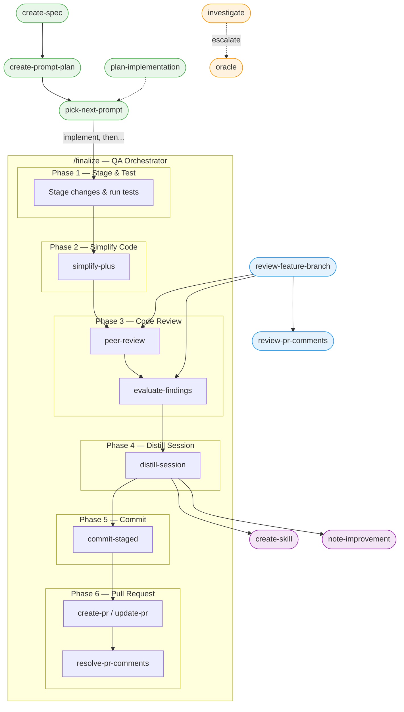

# Turbo

A modular collection of [Claude Code](https://docs.anthropic.com/en/docs/claude-code) skills that speed up everyday dev tasks while keeping quality high.

## What Is This?

Turbo is a skill set for Claude Code. Each skill teaches Claude a specific workflow — reviewing code, creating PRs, investigating bugs, distilling session learnings, and more. The skills are designed to **work together**.

The key idea: skills aren't just standalone tools you use next to each other. They're **puzzle pieces** that connect into larger workflows. The main orchestrator, `/finalize`, chains testing, code simplification, AI review, committing, and PR creation into one command. But each piece is small and swappable — replace one skill with your own and the rest of the pipeline still works.

Turbo doesn't prescribe how you plan or implement — use whatever workflow or framework you prefer. What it cares about is what happens *after*: `/finalize` maximizes code quality before anything gets committed. The wording and phrasing in these skills is heavily optimized and battle-tested with Claude Code and the Opus model. This is fine-tuned for Claude Code and adheres to its conventions rather than inventing new ones.

## How Skills Connect



## Quick Start

### 1. Install Prerequisites

| Tool | What it's for | Install |
|---|---|---|
| [Claude Code](https://docs.anthropic.com/en/docs/claude-code) | AI coding agent that runs Turbo skills | `npm install -g @anthropic-ai/claude-code` |
| [GitHub CLI](https://cli.github.com/) | PR creation, review comments, repo queries | `brew install gh` |
| [Codex CLI](https://github.com/openai/codex) | AI-powered code review in `/finalize` | `npm install -g @openai/codex` |

**Works best with:** Claude Code Max 5x, Max 20x, or Team plan with Premium seats (orchestrator workflows are context-heavy), ChatGPT Plus or higher (for codex review), and ChatGPT Pro or Business (for `/oracle` — Pro models are the only ones that reliably solve very hard problems). That said, `/peer-review` and `/oracle` are designed as swappable puzzle pieces — if you don't have access, replace them with alternatives that work for you.

### 2. Install Skills

```bash
npx skills add tobihagemann/turbo --skill '*' --agent claude-code
```

Install all skills — many depend on each other (e.g., `/finalize` orchestrates `/simplify-plus`, `/codex`, `/evaluate-findings`, and more), so installing them individually will leave gaps in the workflows.

Update regularly to stay compatible with the latest Claude Code version:

```bash
npx skills update
```

See [skills.sh/docs](https://skills.sh/docs) for more on the skills CLI.

### 3. Add `.turbo` to Global Gitignore

Some skills store project-level files in a `.turbo/` directory (specs, prompt plans, improvements). Add it to your global gitignore to keep project repos clean:

```bash
echo '.turbo/' >> ~/.gitignore
git config --global core.excludesfile ~/.gitignore
```

### 4. Set Up Context Tracking (Recommended)

Add this to your Claude Code settings (`~/.claude/settings.json`) to always see how much context you have left:

```json
{
  "statusLine": {
    "type": "command",
    "command": "jq -r '\"\\(.context_window.remaining_percentage | floor)% context left\"'"
  }
}
```

### 5. Add Pre-Implementation Prep to Global Instructions (Recommended)

Add this to `~/.claude/CLAUDE.md` so Claude always reads relevant code before editing:

```markdown
# Pre-Implementation Prep

After plan approval (ExitPlanMode) and before making edits:
1. Run `/code-style` to load code style principles
2. Read all files referenced by the user in their request
3. Read all files mentioned in the plan
4. Read similar files in the project to mirror their style
```

> If anyone figures out how to do this as a hook instead of a CLAUDE.md instruction, PRs welcome!

For a more detailed, interactive walkthrough, see [SETUP.md](SETUP.md).

## The Main Workflow

The recommended way to use Turbo:

1. **Enter plan mode** and plan the implementation
2. **Approve the plan** (tip: clear context when approving to maximize room for implementation)
3. **Run `/finalize`** when you're done implementing

`/finalize` runs through these phases automatically:

1. **Stage & Test** — Stage changed files, write missing tests, run test suite
2. **Simplify Code** — Multi-agent review for reuse, quality, efficiency, clarity
3. **Code Review** — AI peer review, evaluate findings, apply fixes, re-test
4. **Distill Session** — Extract learnings, route to CLAUDE.md / memory / skills
5. **Commit** — Formulate commit message, create commit
6. **Pull Request** — Create or update PR, optionally resolve review comments

### Context Management Tips

- **Disable auto-compact.** You want to control when compaction happens.
- **Keep >50% context free** before running `/finalize` (>40% may also work). If you're low, run `/compact` first.
- The status line from step 3 above makes this easy to track.

### Self-Improvement

`/distill-session` is another core skill — run it anytime before your context runs out (it's also part of `/finalize` Phase 4). It scans the conversation for corrections, repeated guidance, failure modes, and preferences, then routes each lesson to the right place: project CLAUDE.md, auto memory, or existing/new skills. It doesn't invent new conventions — it uses Claude Code's built-in knowledge layers. Over time, this makes Claude better at your specific project.

`/note-improvement` captures improvement opportunities that come up during work but are out of scope — code review findings you chose to skip, refactoring ideas, missing tests. These get tracked in `.turbo/improvements.md` so they don't get lost. Since `.turbo/` is gitignored, it doesn't clutter the repo.

## All Skills

### Orchestrators

| Skill | What it does |
|---|---|
| `/finalize` | Post-implementation QA: test, simplify, review, commit, PR |
| `/review-feature-branch` | Full branch review: AI review + PR comments + evaluation |

### Planning

| Skill | What it does |
|---|---|
| `/create-spec` | Guided discussion that produces a spec at `.turbo/spec.md` |
| `/plan-implementation` | Decompose work into sized, ordered implementation units |
| `/create-prompt-plan` | Break a spec into context-sized implementation prompts |
| `/pick-next-prompt` | Pick the next prompt from `.turbo/prompts.md` and plan it |

### Code Quality

| Skill | What it does |
|---|---|
| `/code-style` | Enforce mirror, reuse, and symmetry principles |
| `/simplify-plus` | Multi-agent review for reuse, quality, efficiency, clarity |
| `/peer-review` | AI code review interface — delegates to `/codex` by default |
| `/codex` | AI code review and task execution via codex CLI |
| `/evaluate-findings` | Confidence-based triage of review feedback |
| `/find-dead-code` | Identify unused code via parallel analysis |

### Git & GitHub

| Skill | What it does |
|---|---|
| `/stage-commit` | Stage files and commit in one step |
| `/commit-staged` | Commit already-staged files with good message |
| `/create-pr` | Draft and create a GitHub PR |
| `/update-pr` | Update existing PR title and description |
| `/review-pr-comments` | Read-only summary of unresolved PR comments |
| `/resolve-pr-comments` | Evaluate, fix, and reply to PR comments |

### Debugging

| Skill | What it does |
|---|---|
| `/investigate` | Systematic root cause analysis for bugs and failures |
| `/smoke-test` | Launch the app and verify changes manually |
| `/oracle` | Consult ChatGPT when completely stuck (requires setup) |

### Knowledge & Maintenance

| Skill | What it does |
|---|---|
| `/distill-session` | Extract session learnings to CLAUDE.md, memory, or skills |
| `/note-improvement` | Capture out-of-scope improvement ideas for later |
| `/create-skill` | Create or update a skill with proper structure |
| `/update-npm-deps` | Smart npm dependency upgrades with breaking change research |

## The Puzzle Piece Philosophy

Every skill is a self-contained piece. The orchestrator skills (`/finalize`, `/review-feature-branch`) compose them into workflows, but each piece works independently too.

Want to swap a piece? For example:
- Replace `/oracle` with your own setup — it's macOS-only and has a cookies workaround
- Replace `/commit-staged` or `/stage-commit` with your team's commit convention — the pipeline adapts

The skills communicate through standard interfaces (git staging area, PR state, file conventions), not tight coupling.

## Oracle Setup

The `/oracle` skill requires additional setup (Chrome, Python, ChatGPT access). See the [oracle skill](skills/oracle/SKILL.md) for configuration via `~/.turbo/config.json`.

If oracle isn't set up, everything still works — `/investigate` offers oracle escalation via a prompt, and you can simply decline.

## License

Distributed under the MIT License. See the [LICENSE](LICENSE) file for details.
