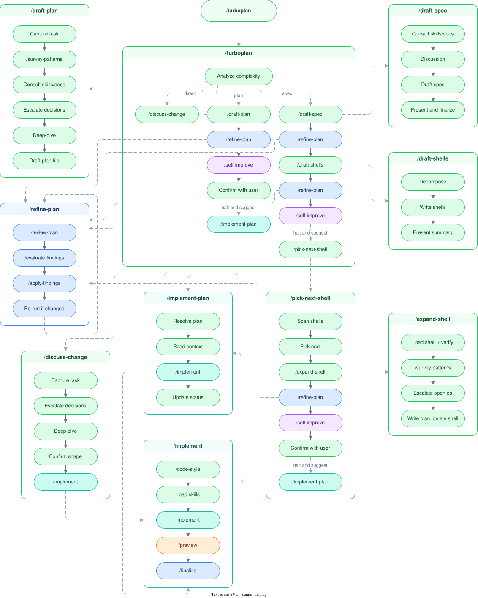
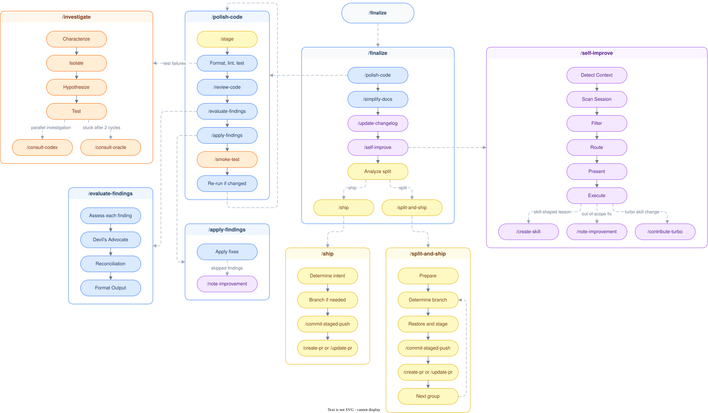

# Turbo

A composable dev process for [Claude Code](https://docs.anthropic.com/en/docs/claude-code), packaged as modular skills. Each skill encodes a dev workflow so you can run it instead of prompting from scratch. Battle-tested with the Opus model.

**TL;DR** — Three steps to ship:

1. **Plan** — Run [`/turboplan`](skills/turboplan/SKILL.md) (or enter raw plan mode) and describe what you want to build
2. **Implement** — Build it with Claude
3. **Run [`/finalize`](skills/finalize/SKILL.md)** — Tests, iterative code polishing, commit, and PR. One command.

This loop is the core. Two more pipelines run alongside it for work that does not fit the loop: [`/audit`](skills/audit/SKILL.md) for project-wide health checks and [`/onboard`](skills/onboard/SKILL.md) for ramping up on new projects. Beyond the four pipelines, Turbo ships [60+ skills](#all-skills) for debugging, reviewing, dependency upgrades, and self-improvement that makes each session teach the next. See the [prompt examples](#prompt-examples) for how they look in practice, or read on for the full picture.

## What Is This?

Turbo covers the full dev lifecycle: reviewing code, creating PRs, investigating bugs, self-improving from session learnings, and more.

Five ideas shape the design:

1. **Standardized process.** Skills capture dev workflows so you can run them directly instead of prompting from scratch. [`/turboplan`](skills/turboplan/SKILL.md) drafts, refines, confirms, and chains into implementation. [`/finalize`](skills/finalize/SKILL.md) runs your entire post-implementation QA in one command. [`/investigate`](skills/investigate/SKILL.md) follows a structured root cause analysis cycle. The skill is the prompt.
2. **Layered design.** Skills compose other skills to any depth. [`/review-correctness`](skills/review-correctness/SKILL.md) analyzes code for bugs. [`/review-code`](skills/review-code/SKILL.md) runs six review skills in parallel. [`/polish-code`](skills/polish-code/SKILL.md) loops format → lint → test → simplify → review → evaluate → apply → smoke test until stable. [`/finalize`](skills/finalize/SKILL.md) wraps the whole pipeline with self-improvement and commit. [`/audit`](skills/audit/SKILL.md) fans out to all analysis skills in parallel, evaluates the combined findings, and produces a health report. Each pipeline composes with a natural, predictable interface. See [The Turboplan Pipeline](#the-turboplan-pipeline) and [The Finalize Pipeline](#the-finalize-pipeline) for worked examples.
3. **Swappable by design.** Every skill owns one concern and communicates through standard interfaces. Replace any piece with your own and the pipeline adapts. See [The Puzzle Piece Philosophy](#the-puzzle-piece-philosophy) for details.
4. **Works out of the box.** Install the skills and the full workflow is ready. Dependencies are standard dev tooling (GitHub CLI, Codex) that most teams already have.
5. **Just skills.** No framework, no custom runtime, no new memory system. Skills are plain markdown that use Claude Code's native primitives (git, filesystem, built-in tools). Remove an independent skill and the rest still work.

The one thing beyond skills is [`CLAUDE-ADDITIONS.md`](CLAUDE-ADDITIONS.md), a small set of behavioral rules added to `~/.claude/CLAUDE.md` during setup. The most important one is **Skill Loading**: without it, Claude tends to skip reloading skills it has already seen in a session, which causes it to silently drop steps in nested pipelines like [`/finalize`](skills/finalize/SKILL.md). The additions are kept in sync by [`/update-turbo`](skills/update-turbo/SKILL.md). See [docs/skill-loading-reasoning.md](docs/skill-loading-reasoning.md) for the full rationale.

The other core piece is [`/self-improve`](skills/self-improve/SKILL.md), which makes the whole system compound. After each session, it extracts lessons from the conversation and routes them to the right place: project CLAUDE.md, auto memory, or existing/new skills. Every session teaches Claude something, and future sessions benefit.

## Works Best With

Turbo amplifies your existing process. It shines when your project has the right infrastructure in place:

- **Tests** — [`/finalize`](skills/finalize/SKILL.md) runs your test suite and reviews test coverage gaps. Without tests, there's no safety net. If your project doesn't have automated tests, [`/smoke-test`](skills/smoke-test/SKILL.md) can fill the gap by launching your app and verifying changes manually (it's part of the [`/polish-code`](skills/polish-code/SKILL.md) loop), but real tests are always better. See [Browser and UI Testing](#browser-and-ui-testing) for the tools that power browser and native app verification.
- **Linters and formatters** — [`/finalize`](skills/finalize/SKILL.md) runs your formatter and linter before code review. If you don't have one, style issues slip through.
- **Pre-commit hooks** — [`/finalize`](skills/finalize/SKILL.md) commits your changes, which triggers any pre-commit hooks you have configured. Claude Code respects hook failures and fixes issues before retrying. If your project uses tools like `husky`, `lint-staged`, or `pre-commit`, Turbo works with them automatically.
- **Dead code analysis** — [`/find-dead-code`](skills/find-dead-code/SKILL.md) (standalone skill, not part of [`/finalize`](skills/finalize/SKILL.md)) identifies unused code via parallel analysis, but it's even better when your project already has tools like `knip`, `vulture`, or `periphery` integrated.
- **Dependencies** — [GitHub CLI](https://cli.github.com/) and [Codex CLI](https://github.com/openai/codex) power PR operations and peer review. Everything works without them, but the full pipeline is better with them. See the [manual setup guide](docs/manual-setup.md#5-install-prerequisites) for details.

## Who It's For

The target audience is experienced developers who want to move faster without sacrificing quality. That said, beginners are welcome too. Turbo is a great way to learn how a professional dev workflow looks. Just don't blindly trust outputs. Review what Claude produces, understand _why_ it made those choices, and build your own judgment alongside it.

If your plan is vague, your architecture is unclear, and you skip every review finding, Turbo won't save you. Garbage in, garbage out.

## The Puzzle Piece Philosophy

Every skill is a self-contained piece. Pipeline skills like [`/finalize`](skills/finalize/SKILL.md) and [`/audit`](skills/audit/SKILL.md) compose them into workflows, but each piece works independently too.

Want to swap a piece? For example:

- Replace [`/consult-oracle`](skills/consult-oracle/SKILL.md) with your own setup (it's macOS-only and has a cookies workaround)
- Replace [`/commit-rules`](skills/commit-rules/SKILL.md) or [`/changelog-rules`](skills/changelog-rules/SKILL.md) with your team's conventions. The pipeline adapts.
- Replace [`/code-style`](skills/code-style/SKILL.md) with your team's style guide. The built-in one teaches general principles rather than opinionated rules, so it's a natural swap point.

This is also why analysis skills and workflow skills both exist. [`/review-correctness`](skills/review-correctness/SKILL.md) analyzes code and returns structured findings. [`/review-code`](skills/review-code/SKILL.md) composes [`/review-test-coverage`](skills/review-test-coverage/SKILL.md), [`/review-correctness`](skills/review-correctness/SKILL.md), [`/review-security`](skills/review-security/SKILL.md), [`/review-quality`](skills/review-quality/SKILL.md), [`/review-api-usage`](skills/review-api-usage/SKILL.md), and [`/peer-review`](skills/peer-review/SKILL.md) into one aggregated review. Run the analysis skill when you want a single-concern scan. Run the workflow when you want the combined results.

Skills communicate through standard interfaces: git staging area, PR state, and file conventions.

## Sponsorship

If Turbo has helped you ship faster and you're so inclined, I'd greatly appreciate it if you'd consider [sponsoring my open source work](https://github.com/sponsors/tobihagemann).


## Quick Start

### Prerequisites

Turbo requires [Claude Code](https://docs.anthropic.com/en/docs/claude-code). Works best with Claude Code Max 5x, Max 20x, or Team plan with Premium seats (pipeline workflows are context-heavy). Additional tools are installed during setup.

**External services:** ChatGPT Plus or higher (for codex peer review), and ChatGPT Pro or Business (for [`/consult-oracle`](skills/consult-oracle/SKILL.md), where Pro models are the only ones that reliably solve very hard problems). That said, [`/peer-review`](skills/peer-review/SKILL.md) and [`/consult-oracle`](skills/consult-oracle/SKILL.md) are designed as swappable puzzle pieces, so if you don't have access, replace them with alternatives that work for you.

### Automatic Setup (Recommended)

Open Claude Code and prompt:

```
Walk me through the Turbo setup. Read SETUP.md from the tobihagemann/turbo repo and guide me through each step.
```

Claude will clone the repo, copy the skills, configure your environment, and walk you through each step interactively.

### Updating

Run [`/update-turbo`](skills/update-turbo/SKILL.md) in Claude Code to update all skills. It fetches the latest update instructions from GitHub, builds a changelog, handles conflict detection for customized skills, and manages exclusions.

### Manual Setup

See the [manual setup guide](docs/manual-setup.md) for step-by-step instructions.

## The Turboplan Pipeline

Claude Code's built-in plan mode is a starting point, but it tends to produce plans that miss existing patterns, skip edge cases, or propose approaches that don't hold up under scrutiny. It can also feel too restrictive for iterative planning. Turbo replaces raw plan mode with [`/turboplan`](skills/turboplan/SKILL.md) as a universal entry point. You always start with `/turboplan` — whether your task is a single-session change or a multi-subsystem project. `/turboplan` analyzes the task, routes it through the right pipeline, and produces plans that survive contact with reality, written to `.turbo/plans/<slug>.md`. `/turboplan` does not require plan mode to be active, and it can chain straight into implementation and [`/finalize`](skills/finalize/SKILL.md) so a single command covers the full loop.



[`/turboplan`](skills/turboplan/SKILL.md) has three modes, selected automatically by its complexity analysis:

- **Small-task mode** — Single-session change. Runs [`/draft-plan`](skills/draft-plan/SKILL.md) (survey + escalate + discuss + draft) → [`/refine-plan`](skills/refine-plan/SKILL.md) → confirmation → [`/implement-plan`](skills/implement-plan/SKILL.md) → [`/finalize`](skills/finalize/SKILL.md).
- **Complex-project mode** — Multi-subsystem project with architectural decisions. Routes to [`/create-spec`](skills/create-spec/SKILL.md) for a guided spec discussion, then [`/create-prompt-plan`](skills/create-prompt-plan/SKILL.md) to decompose the spec into shell plans. Halts after the prompt plan is ready; you run [`/pick-next-prompt`](skills/pick-next-prompt/SKILL.md) in fresh sessions to implement each shell.
- **Shell mode** — Triggered when `/pick-next-prompt` hands a shell plan to `/turboplan`. Skips the complexity analysis and routes to `/draft-plan` in fill-in mode (verifies consumes against the current codebase, refreshes the pattern survey, escalates the shell's open questions, fills in concrete file references and verification), then refine → confirm → implement → finalize.

Every sub-skill works standalone too. Run [`/draft-plan`](skills/draft-plan/SKILL.md) directly if you want to draft a plan without the rest of the pipeline. Run [`/refine-plan`](skills/refine-plan/SKILL.md) on a plan you wrote yourself. Run [`/implement-plan`](skills/implement-plan/SKILL.md) in a fresh session on any plan file. Run [`/create-spec`](skills/create-spec/SKILL.md) to write a spec without committing to the full pipeline.

### Shell plans and the prompt plan flow

For complex projects, `/create-prompt-plan` produces **shell plans**: structured decomposition artifacts that capture the wiring invariants (Produces, Consumes, Covers spec requirements) and high-level Implementation Steps without committing to concrete file paths. Each shell is a file at `.turbo/plans/<spec-slug>-NN-<title>.md`. The prompt plan index at `.turbo/prompt-plans/<slug>.md` is a thin manifest that tracks status and dependencies.

The decomposition work — ensuring spec coverage, correct wiring, no dead ends, no duplication — happens at create time against the structured fields. [`/review-prompt-plan`](skills/review-prompt-plan/SKILL.md) verifies the wiring invariants across all shells. The parts that depend on current codebase state (pattern survey, concrete `file_path:line_number` references, verification commands) are deferred to implementation time.

When you run `/pick-next-prompt`, it picks the next ready shell, marks it in-progress in the index, and hands the shell file path to `/turboplan`. `/turboplan` runs in shell mode: `/draft-plan` in fill-in mode expands the shell with fresh codebase state, then the usual refine → confirm → implement → finalize flow runs. Each implementation session gets fresh pattern surveys, so decisions from earlier sessions naturally inform later ones.

## The Finalize Pipeline

[`/finalize`](skills/finalize/SKILL.md) is the QA and commit side of the loop. Run it when you're done implementing, or let [`/turboplan`](skills/turboplan/SKILL.md) chain into it automatically. One command runs tests, iterative code polishing, changelog updates, self-improvement, and commit.



`/finalize` runs through these phases automatically:

1. **Polish Code** — Iterative loop: stage → format → lint → test → simplify → review → evaluate → apply → smoke test → re-run until stable
2. **Update Changelog** — Add entries to the Unreleased section of CHANGELOG.md (skipped if no changelog exists)
3. **Self-Improve** — Extract learnings, route to CLAUDE.md / memory / skills
4. **Ship It** — Branch if needed, commit, push, create or update PR

## Self-Improvement

[`/self-improve`](skills/self-improve/SKILL.md) is a core skill that makes each session teach the next. Run it anytime before ending your session (it's also part of [`/finalize`](skills/finalize/SKILL.md) Phase 3). It scans the conversation for corrections, repeated guidance, failure modes, and preferences, then routes each lesson to the right place: project CLAUDE.md, auto memory, or existing/new skills. Over time, Turbo gets better at your specific project.

[`/note-improvement`](skills/note-improvement/SKILL.md) captures improvement opportunities that come up during work but are out of scope: code review findings you chose to skip, refactoring ideas, missing tests. These get tracked in `.turbo/improvements.md` so they don't get lost. Since `.turbo/` is gitignored, it doesn't clutter the repo. When you're ready to act on them, [`/implement-improvements`](skills/implement-improvements/SKILL.md) validates each entry against the current codebase (filtering out stale items), then plans and implements the remaining ones.

## Out-of-Loop Pipelines

Two pipelines run alongside the main loop instead of inside it. They are not part of plan-implement-finalize, but they share the same composition style.

### Project-Wide Audit

[`/audit`](skills/audit/SKILL.md) fans out to all analysis skills in parallel (correctness, security, API usage, quality, test coverage, dependencies, tooling, dead code), evaluates the combined findings, and produces a health report at `.turbo/audit.md` with a dashboard and an interactive HTML version. Run it to assess codebase health before a major release, after onboarding to a new project, or on a regular cadence.

[`/audit`](skills/audit/SKILL.md) is analysis-only: it produces the report and stops there. When you're ready to act on findings, use [`/apply-findings`](skills/apply-findings/SKILL.md) or address them manually.

### Developer Onboarding

[`/onboard`](skills/onboard/SKILL.md) generates a comprehensive onboarding guide for new developers joining a project. It composes [`/map-codebase`](skills/map-codebase/SKILL.md) (architecture), [`/review-tooling`](skills/review-tooling/SKILL.md) (development workflow), and [`/review-agentic-setup`](skills/review-agentic-setup/SKILL.md) (AI coding infrastructure) with inline agents for prerequisites, troubleshooting, and next steps (top GitHub issues). The result is `.turbo/onboarding.md` with an interactive HTML version.

The guide covers both traditional onboarding (setup, build commands, tooling) and agentic onboarding (what CLAUDE.md/AGENTS.md cover, installed skills, MCP servers, Claude Code vs Codex CLI compatibility). If a [threat model](#project-wide-audit) exists, security considerations are included too.

[`/map-codebase`](skills/map-codebase/SKILL.md) also works standalone when you just need the architecture report without the full onboarding guide.

## Browser and UI Testing

[`/smoke-test`](skills/smoke-test/SKILL.md) and [`/comprehensive-test`](skills/comprehensive-test/SKILL.md) automate manual testing — the kind of hands-on verification you'd normally do yourself. These tools determine how Claude interacts with your app:

- **[agent-browser](https://github.com/vercel-labs/agent-browser)** — Companion skill for browser automation. Provides the most control for web app testing.
- **`claude-in-chrome` MCP** — Built-in Claude Code browser automation using your real Chrome browser. Falls back to this when agent-browser is not installed.
- **`computer-use` MCP** — Built-in Claude Code screen control for native app and UI testing on macOS.

## Prompt Examples

These are prompts you can type directly into Claude Code. Skill names work as natural words in your sentences.

```
# Planning a change (single entry — /turboplan routes based on complexity)
/turboplan add a caching layer to the image pipeline  ← small task → draft → refine → implement
/turboplan build a notification system with backend, API, and UI  ← complex → spec → prompt plan → halt
/survey-patterns  ← pattern-ground an approach without drafting a plan
/implement-plan  ← execute the latest plan in .turbo/plans/ in a fresh session

# Continuing a complex project
/pick-next-prompt  ← pick next ready shell → /turboplan fills it in → refine → implement

# Investigating bugs
tests are failing in the auth module, can you please /investigate?
/investigate the app crashes when i click "save" after editing a profile

# Reviewing code
/review-code
/review-pr for PR #42

# Auditing project health
/audit
read @.turbo/audit.md and /apply-findings  ← follow-up session

# Onboarding to a new project
/onboard
/map-codebase  ← architecture report only

# Resolving PR feedback
/resolve-pr-comments

# Updating dependencies
/update-dependencies

# Working through the improvements backlog
the error messages in this module are inconsistent, /note-improvement
/implement-improvements  ← dedicated session

# Testing manually
/smoke-test
/comprehensive-test

# Picking the next issue to work on
/pick-next-issue

# Extracting session learnings
/self-improve

# Creating a new skill
/create-skill for a skill that <description>
```

## All Skills

### Pipelines

| Skill | What it does | Uses |
|---|---|---|
| [`/turboplan`](skills/turboplan/SKILL.md) | Universal planning entry: analyzes complexity and routes to small-task (draft → refine → implement), complex-project (spec → prompt plan), or shell (fill-in → refine → implement) mode | [`/draft-plan`](skills/draft-plan/SKILL.md), [`/refine-plan`](skills/refine-plan/SKILL.md), [`/implement-plan`](skills/implement-plan/SKILL.md), [`/create-spec`](skills/create-spec/SKILL.md), [`/create-prompt-plan`](skills/create-prompt-plan/SKILL.md) |
| [`/finalize`](skills/finalize/SKILL.md) | Post-implementation QA: polish, changelog, commit, PR | [`/polish-code`](skills/polish-code/SKILL.md), [`/update-changelog`](skills/update-changelog/SKILL.md), [`/self-improve`](skills/self-improve/SKILL.md), [`/ship`](skills/ship/SKILL.md), [`/split-and-ship`](skills/split-and-ship/SKILL.md) |
| [`/audit`](skills/audit/SKILL.md) | Project-wide health audit: all analysis skills, evaluation, markdown and HTML report | [`/review-correctness`](skills/review-correctness/SKILL.md), [`/review-security`](skills/review-security/SKILL.md), [`/review-api-usage`](skills/review-api-usage/SKILL.md), [`/peer-review`](skills/peer-review/SKILL.md), [`/review-quality`](skills/review-quality/SKILL.md), [`/review-test-coverage`](skills/review-test-coverage/SKILL.md), [`/review-dependencies`](skills/review-dependencies/SKILL.md), [`/review-tooling`](skills/review-tooling/SKILL.md), [`/review-agentic-setup`](skills/review-agentic-setup/SKILL.md), [`/find-dead-code`](skills/find-dead-code/SKILL.md), [`/create-threat-model`](skills/create-threat-model/SKILL.md), [`/evaluate-findings`](skills/evaluate-findings/SKILL.md), [`/frontend-design`](skills/frontend-design/SKILL.md) |
| [`/onboard`](skills/onboard/SKILL.md) | Developer onboarding guide: architecture, tooling, agentic setup, prerequisites, troubleshooting, next steps | [`/map-codebase`](skills/map-codebase/SKILL.md), [`/review-tooling`](skills/review-tooling/SKILL.md), [`/review-agentic-setup`](skills/review-agentic-setup/SKILL.md), [`/frontend-design`](skills/frontend-design/SKILL.md) |

### Workflows

| Skill | What it does | Uses |
|---|---|---|
| [`/polish-code`](skills/polish-code/SKILL.md) | Iterative quality loop: stage → format → lint → test → simplify → review → evaluate → apply → smoke test → re-run until stable | [`/stage`](skills/stage/SKILL.md), [`/simplify-code`](skills/simplify-code/SKILL.md), [`/review-code`](skills/review-code/SKILL.md), [`/evaluate-findings`](skills/evaluate-findings/SKILL.md), [`/apply-findings`](skills/apply-findings/SKILL.md), [`/smoke-test`](skills/smoke-test/SKILL.md), [`/investigate`](skills/investigate/SKILL.md) |
| [`/review-code`](skills/review-code/SKILL.md) | AI code review: 6 parallel reviewers | [`/review-test-coverage`](skills/review-test-coverage/SKILL.md), [`/review-correctness`](skills/review-correctness/SKILL.md), [`/review-security`](skills/review-security/SKILL.md), [`/review-quality`](skills/review-quality/SKILL.md), [`/review-api-usage`](skills/review-api-usage/SKILL.md), [`/peer-review`](skills/peer-review/SKILL.md) |
| [`/draft-plan`](skills/draft-plan/SKILL.md) | Produces a plan at `.turbo/plans/<slug>.md`. Full mode: guided discussion then draft. Fill-in mode: expands a shell from `/create-prompt-plan` with fresh pattern survey and concrete references | [`/survey-patterns`](skills/survey-patterns/SKILL.md) |
| [`/refine-plan`](skills/refine-plan/SKILL.md) | Iterative review loop over a plan file until stable: review → evaluate → apply → re-run | [`/review-plan`](skills/review-plan/SKILL.md), [`/evaluate-findings`](skills/evaluate-findings/SKILL.md), [`/apply-findings`](skills/apply-findings/SKILL.md) |
| [`/implement-plan`](skills/implement-plan/SKILL.md) | Execute a plan file: pre-impl prep, load task-specific skills, execute steps, run `/finalize` | [`/code-style`](skills/code-style/SKILL.md), [`/finalize`](skills/finalize/SKILL.md) |
| [`/review-plan`](skills/review-plan/SKILL.md) | AI plan review: internal review and peer review in parallel | [`/peer-review`](skills/peer-review/SKILL.md) |
| [`/review-spec`](skills/review-spec/SKILL.md) | AI spec review: internal review and peer review in parallel | [`/peer-review`](skills/peer-review/SKILL.md) |
| [`/review-prompt-plan`](skills/review-prompt-plan/SKILL.md) | AI prompt plan review: internal review and peer review in parallel | [`/peer-review`](skills/peer-review/SKILL.md) |
| [`/review-pr`](skills/review-pr/SKILL.md) | PR review: fetch comments, detect base branch, run code review, evaluate findings | [`/fetch-pr-comments`](skills/fetch-pr-comments/SKILL.md), [`/review-code`](skills/review-code/SKILL.md), [`/evaluate-findings`](skills/evaluate-findings/SKILL.md) |
| [`/simplify-code`](skills/simplify-code/SKILL.md) | Review code quality and fix issues | |
| [`/apply-findings`](skills/apply-findings/SKILL.md) | Apply findings from evaluations or reviews | [`/note-improvement`](skills/note-improvement/SKILL.md) |
| [`/update-dependencies`](skills/update-dependencies/SKILL.md) | Smart dependency upgrades with breaking change research | [`/review-dependencies`](skills/review-dependencies/SKILL.md) |
| [`/map-codebase`](skills/map-codebase/SKILL.md) | Deep architecture report: parallel inspections across structure, stack, APIs, patterns, data flow, dependencies, testing | [`/frontend-design`](skills/frontend-design/SKILL.md) |

### Analysis

| Skill | What it does | Uses |
|---|---|---|
| [`/review-correctness`](skills/review-correctness/SKILL.md) | Analyze code for bugs, logic errors, and correctness problems | |
| [`/review-security`](skills/review-security/SKILL.md) | Security-focused code review with threat model integration | |
| [`/review-api-usage`](skills/review-api-usage/SKILL.md) | Check API/library usage against official documentation | |
| [`/review-quality`](skills/review-quality/SKILL.md) | Cross-file quality analysis: duplication, architectural consistency, abstraction opportunities | |
| [`/review-test-coverage`](skills/review-test-coverage/SKILL.md) | Analyze code for test coverage gaps and missing edge cases | |
| [`/review-dependencies`](skills/review-dependencies/SKILL.md) | Detect outdated or vulnerable dependencies | |
| [`/review-tooling`](skills/review-tooling/SKILL.md) | Detect dev tooling gaps across linters, formatters, hooks, test runners, and CI/CD | |
| [`/review-agentic-setup`](skills/review-agentic-setup/SKILL.md) | Detect agentic coding infrastructure: CLAUDE.md, AGENTS.md, skills, MCP, hooks, cross-tool compatibility | |
| [`/peer-review`](skills/peer-review/SKILL.md) | Independent peer review via codex (code, plans, specs, prompt plans, feedback) | [`/codex-exec`](skills/codex-exec/SKILL.md) |
| [`/interpret-feedback`](skills/interpret-feedback/SKILL.md) | Parallel internal + codex interpretation of third-party feedback | [`/peer-review`](skills/peer-review/SKILL.md) |
| [`/evaluate-findings`](skills/evaluate-findings/SKILL.md) | Triage review feedback with adversarial verification | |
| [`/survey-patterns`](skills/survey-patterns/SKILL.md) | Survey the codebase for analogous features, reusable utilities, and convention anchors | |
| [`/find-dead-code`](skills/find-dead-code/SKILL.md) | Identify unused code via parallel analysis | [`/evaluate-findings`](skills/evaluate-findings/SKILL.md), [`/investigate`](skills/investigate/SKILL.md) |
| [`/investigate`](skills/investigate/SKILL.md) | Systematic root cause analysis for bugs and failures | [`/consult-codex`](skills/consult-codex/SKILL.md), [`/evaluate-findings`](skills/evaluate-findings/SKILL.md), [`/consult-oracle`](skills/consult-oracle/SKILL.md) |
| [`/smoke-test`](skills/smoke-test/SKILL.md) | Launch the app and verify changes manually | [`/agent-browser`](https://github.com/vercel-labs/agent-browser), [`/investigate`](skills/investigate/SKILL.md) |
| [`/comprehensive-test`](skills/comprehensive-test/SKILL.md) | Multi-level testing: basic, complex, adversarial, and cross-cutting scenarios | [`/create-test-plan`](skills/create-test-plan/SKILL.md), [`/agent-browser`](https://github.com/vercel-labs/agent-browser), [`/investigate`](skills/investigate/SKILL.md) |
| [`/codex-review`](skills/codex-review/SKILL.md) | AI code review via codex CLI | [Codex CLI](https://github.com/openai/codex) |
| [`/codex-exec`](skills/codex-exec/SKILL.md) | Autonomous task execution via codex CLI | [Codex CLI](https://github.com/openai/codex) |
| [`/consult-codex`](skills/consult-codex/SKILL.md) | Multi-turn consultation with codex CLI | [Codex CLI](https://github.com/openai/codex) |
| [`/consult-oracle`](skills/consult-oracle/SKILL.md) | Consult ChatGPT Pro when completely stuck (requires setup) | [`/evaluate-findings`](skills/evaluate-findings/SKILL.md), [`/apply-findings`](skills/apply-findings/SKILL.md), [ChatGPT Pro](https://chatgpt.com/) |
| [`/recall-reasoning`](skills/recall-reasoning/SKILL.md) | Recall implementation reasoning from past Claude Code transcripts for a commit or file location | |

### Planning

| Skill | What it does | Uses |
|---|---|---|
| [`/create-spec`](skills/create-spec/SKILL.md) | Guided discussion that produces a spec at `.turbo/specs/<slug>.md` | [`/review-spec`](skills/review-spec/SKILL.md), [`/evaluate-findings`](skills/evaluate-findings/SKILL.md), [`/apply-findings`](skills/apply-findings/SKILL.md) |
| [`/create-test-plan`](skills/create-test-plan/SKILL.md) | Generate a structured test plan at `.turbo/test-plan.md` with four escalating levels | |
| [`/create-prompt-plan`](skills/create-prompt-plan/SKILL.md) | Decompose a spec into shell plans with structured wiring invariants (Produces, Consumes, Covers). Writes shells to `.turbo/plans/` and an index to `.turbo/prompt-plans/` | [`/review-prompt-plan`](skills/review-prompt-plan/SKILL.md), [`/evaluate-findings`](skills/evaluate-findings/SKILL.md), [`/apply-findings`](skills/apply-findings/SKILL.md) |
| [`/pick-next-prompt`](skills/pick-next-prompt/SKILL.md) | Pick the next ready shell from a prompt plan index, mark in-progress, hand to `/turboplan` in shell mode for fill-in | [`/turboplan`](skills/turboplan/SKILL.md) |
| [`/pick-next-issue`](skills/pick-next-issue/SKILL.md) | Pick the most popular open GitHub issue and plan it | [`/turboplan`](skills/turboplan/SKILL.md) |
| [`/code-style`](skills/code-style/SKILL.md) | Enforce mirror, reuse, and symmetry principles | |
| [`/frontend-design`](skills/frontend-design/SKILL.md) | Design guidelines for distinctive, production-grade frontend interfaces | |

### Git & GitHub

| Skill | What it does | Uses |
|---|---|---|
| [`/stage`](skills/stage/SKILL.md) | Stage implementation changes with precise file selection | |
| [`/stage-commit`](skills/stage-commit/SKILL.md) | Stage files and commit in one step | [`/stage`](skills/stage/SKILL.md), [`/commit-staged`](skills/commit-staged/SKILL.md) |
| [`/stage-commit-push`](skills/stage-commit-push/SKILL.md) | Stage, commit, and push in one step | [`/stage-commit`](skills/stage-commit/SKILL.md) |
| [`/commit-staged`](skills/commit-staged/SKILL.md) | Commit already-staged files with good message | [`/commit-rules`](skills/commit-rules/SKILL.md) |
| [`/commit-staged-push`](skills/commit-staged-push/SKILL.md) | Commit already-staged files and push | [`/commit-staged`](skills/commit-staged/SKILL.md) |
| [`/ship`](skills/ship/SKILL.md) | Commit, push, and optionally create or update a PR | [`/commit-staged-push`](skills/commit-staged-push/SKILL.md), [`/create-pr`](skills/create-pr/SKILL.md), [`/update-pr`](skills/update-pr/SKILL.md) |
| [`/split-and-ship`](skills/split-and-ship/SKILL.md) | Ship split plan as separate branches, commits, and PRs | [`/commit-staged-push`](skills/commit-staged-push/SKILL.md), [`/create-pr`](skills/create-pr/SKILL.md), [`/update-pr`](skills/update-pr/SKILL.md) |
| [`/commit-rules`](skills/commit-rules/SKILL.md) | Shared commit message rules and technical constraints | |
| [`/create-pr`](skills/create-pr/SKILL.md) | Draft and create a GitHub PR | [`/github-voice`](skills/github-voice/SKILL.md) |
| [`/update-pr`](skills/update-pr/SKILL.md) | Update existing PR title and description | [`/github-voice`](skills/github-voice/SKILL.md) |
| [`/fetch-pr-comments`](skills/fetch-pr-comments/SKILL.md) | Read-only summary of unresolved PR comments | |
| [`/resolve-pr-comments`](skills/resolve-pr-comments/SKILL.md) | Evaluate, fix, answer, and reply to PR comments (including reviewer questions) | [`/interpret-feedback`](skills/interpret-feedback/SKILL.md), [`/evaluate-findings`](skills/evaluate-findings/SKILL.md), [`/turboplan`](skills/turboplan/SKILL.md), [`/apply-findings`](skills/apply-findings/SKILL.md), [`/finalize`](skills/finalize/SKILL.md), [`/recall-reasoning`](skills/recall-reasoning/SKILL.md), [`/github-voice`](skills/github-voice/SKILL.md) |

### Knowledge & Maintenance

| Skill | What it does | Uses |
|---|---|---|
| [`/self-improve`](skills/self-improve/SKILL.md) | Extract session learnings to CLAUDE.md, memory, or skills | |
| [`/note-improvement`](skills/note-improvement/SKILL.md) | Capture out-of-scope improvement ideas to `.turbo/improvements.md` | |
| [`/implement-improvements`](skills/implement-improvements/SKILL.md) | Validate and implement improvements from the backlog | [`/turboplan`](skills/turboplan/SKILL.md) |
| [`/create-skill`](skills/create-skill/SKILL.md) | Create or update a skill with proper structure | [`/evaluate-findings`](skills/evaluate-findings/SKILL.md), [`/apply-findings`](skills/apply-findings/SKILL.md) |
| [`/create-changelog`](skills/create-changelog/SKILL.md) | Create a CHANGELOG.md with version history backfilled from GitHub releases or git tags | [`/changelog-rules`](skills/changelog-rules/SKILL.md) |
| [`/update-changelog`](skills/update-changelog/SKILL.md) | Update the Unreleased section of CHANGELOG.md based on current changes (no-op if no changelog) | [`/changelog-rules`](skills/changelog-rules/SKILL.md) |
| [`/changelog-rules`](skills/changelog-rules/SKILL.md) | Shared changelog conventions and formatting rules | |
| [`/create-threat-model`](skills/create-threat-model/SKILL.md) | Analyze a codebase and produce a threat model at `.turbo/threat-model.md` | |
| [`/update-turbo`](skills/update-turbo/SKILL.md) | Update Turbo skills with always-latest instructions fetched from GitHub | |
| [`/contribute-turbo`](skills/contribute-turbo/SKILL.md) | Submit turbo skill improvements back to upstream | [`/commit-rules`](skills/commit-rules/SKILL.md), [`/github-voice`](skills/github-voice/SKILL.md) |

## License

Distributed under the MIT License. See the [LICENSE](LICENSE) file for details.
