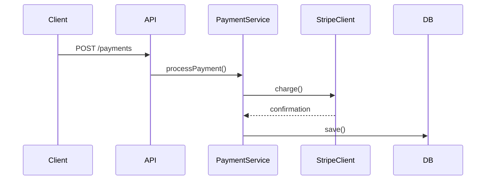
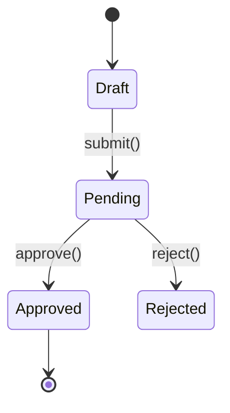

# Create Pull Request

Draft a concise and descriptive title and a body for a PR. Explain the purpose of the changes, the problem they solve, and the general approach taken. When the changes involve clear runtime flows or state transitions, include Mermaid diagrams.

## Step 1: Analyze Changes

If git is in a feature branch, examine all commit messages and the full diff to understand the overall changes. Analyze the diff for framing and diagram opportunities.

Source every claim about prior behavior from the base branch itself, by reading its code with `git show origin/<base>:<path>`. A long session leaves the working tree carrying intermediate states that were never the state this PR is measured against, and describing one of those as the prior behavior misleads the reviewer.

Before writing that two pull requests must land together, check whether the consumer uses what changed: `git grep <symbol>` in its checkout, or the other repository's working copy when the dependency crosses repositories. When it does, name the actual cause. When it does not, drop the landing-order claim and keep any reference to the related pull request as plain context. State the claim as unverified when the consumer is not reachable.

## Step 2: Run `$github-voice` Skill

Run the `$github-voice` skill to load writing style rules.

## Step 3: Draft Title and Description

Pick a framing, then draft a title and description in it, embedding any diagrams in the body. Output the drafted title and description as chat text so the user can review it.

## Step 4: Confirm and Create

Use `request_user_input` for confirmation only. Generate a random tag so the body file is unique across sessions:

```bash
head -c 4 /dev/urandom | xxd -p
```

Write the drafted body to `.turbo/pr/<tag>-body.md` (using the printed tag) with `apply_patch`, then create the PR with `gh pr create --body-file`:

```bash
gh pr create --title "<TITLE>" --body-file .turbo/pr/<tag>-body.md
```

Do not set `--assignee` unless the user explicitly asks to assign someone.

## Framing

Every body says what the change does and why. How it is organized past that follows from what the change is: pick the framing that carries the most user-visible meaning, and combine two when the change genuinely has both shapes.

### Summary Paragraph

The default. Use when the PR makes one coherent change with one purpose.

### Itemized Changes

Use when the PR carries several distinct changes and the reviewer needs the inventory. One item per change, ordered by what matters most.

### User Stories

Use when the change delivers capability someone can name. Write each as `As a <persona>, I want <capability> so that <outcome>.`

### Before and After

Use when the reviewer's question is what changed rather than what exists: several distinct fixes, or behavior that reads as a feature description unless the delta is spelled out. Give each item a Before line and an After line.

Write Before lines in the past tense, with two exceptions. A sentence describing code the PR leaves alone stays present tense. A claim about what was merely possible stays modal ("could post"), never simple past, which asserts it happened.

### Rules

- Raise each item to behavior a user or operator would notice. Mechanism the reviewer can read off the diff belongs in the diff.

## Diagrams

GitHub renders Mermaid natively in PR descriptions via ` ```mermaid ` code blocks. Include diagrams only when they add clarity a text description can't — skip for trivial changes or obvious flows.

### Sequence Diagram

Include when the changes introduce or modify a clear runtime flow: API endpoints, event handlers, pipelines, multi-service interactions, webhook flows.

````markdown

````

### State Diagram

Include when the changes add or modify entity states, status enums, workflow transitions, or lifecycle hooks.

````markdown

````

### Rules

- Only include when the diagram genuinely adds clarity
- Keep diagrams focused — max ~10 nodes/transitions
- Use descriptive labels on arrows (method names, HTTP verbs)
- Place diagrams after the opening body text under a `## Flow` or `## State Machine` heading
- One diagram per type max — don't include both unless the PR truly has both patterns

## Rules

- Don't reference `.turbo/` content (filenames, acceptance criteria, step numbers, headings) in the title or body. `.turbo/` is gitignored, so these references would be opaque to anyone reading without local copies.
