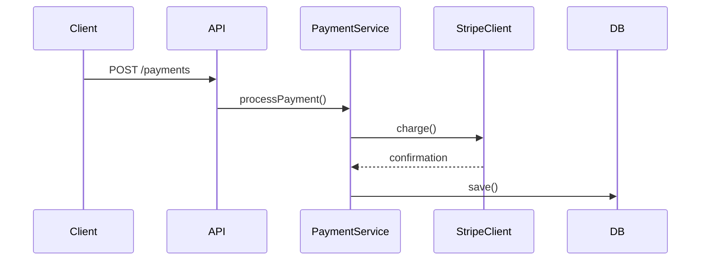
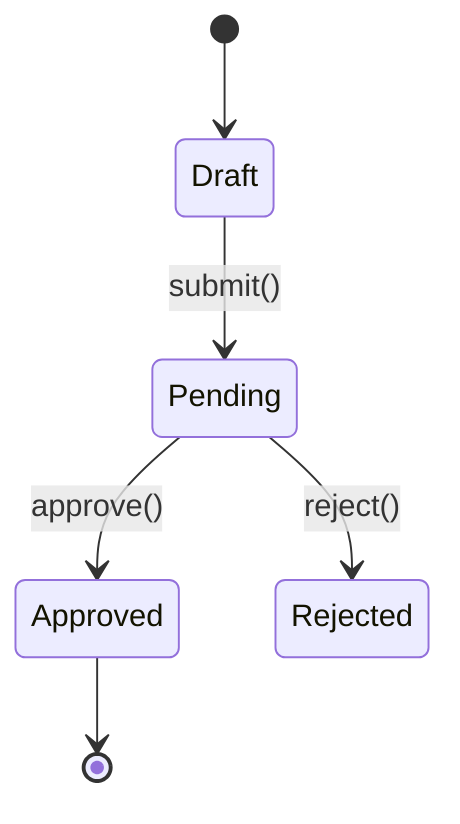

# Update PR Title and Description

Read the current PR title and body, analyze what changed in the session, and draft an updated title and description that preserves the original writing style.

## Step 1: Fetch Current PR

Fetch the current PR details:

```bash
gh pr view [PR_NUMBER] --json number,title,body,baseRefName,commits
```

Omit PR_NUMBER to auto-detect from current branch.

## Step 2: Analyze the Existing Style

Before drafting, study the current title and body to identify:

- **Title format** — length, prefix conventions (e.g., `feat:`, `fix:`), capitalization
- **Body structure** — headings, bullet points, sections, line length
- **Tone** — formal vs. casual, terse vs. detailed
- **Content patterns** — does it explain the "why", list changes, include test plans?
- **Diagrams** — does the body contain Mermaid code blocks (sequence, state, or other)?

## Step 3: Evaluate Whether an Update Is Needed

Run `git fetch origin <base>` so the remote ref is current before any diff below. A local branch of the same name can sit behind the remote, which puts the merge base before an already-merged pull request and pulls merged work into the description.

Read the fetched body against the current diff and list what the body leaves undescribed:

```bash
git diff origin/<base>...HEAD
```

Check every Mermaid diagram in the body the same way, node by node and transition by transition. A diagram that omits a state still renders, so only the code reveals its staleness.

If the body and its diagrams already describe the diff, the description is up to date. Say so and stop.

If what the body leaves undescribed is only trivial (formatting, typos, config-only), say so and stop. Proceed when the body omits, misstates, or still describes behavior the diff no longer contains.

## Step 4: Analyze the Full Diff

Derive the PR description from the full diff, not from individual commits. The description should reflect the net change — what the code looks like now vs. the base — not the development journey. Intermediate bug fixes, reverted approaches, and implementation pivots that happened during development are not relevant to the reader.

1. Work from the full diff Step 3 read (`git diff origin/<base>...HEAD`) — this is the primary source of truth
2. Use what Step 3 found undescribed to understand what's new, but frame everything in the context of the whole PR
3. Check if the changes introduce runtime flows or state transitions that warrant diagrams (see Diagrams section below)

## Step 5: Run `$github-voice` Skill

Run the `$github-voice` skill to load writing style rules.

## Step 6: Draft Updated Title and Description

Write an updated title and body that:

- **Matches the original style** — same structure, tone, formatting, and level of detail
- **Reflects the net change** — describe what the full diff shows, not the development history
- **Preserves what still applies** — keep existing text that remains accurate
- **Adds what's new** — integrate new changes naturally into the existing structure
- **Removes what's stale** — drop descriptions of work that was reverted or replaced
- **Scopes to the target repository** — write for someone who knows only the repository the PR targets; when the change is paired with work in another repository, name the interface the code calls and leave that repository's internal names, data shapes, and mechanisms out of the body
- **Updates diagrams** — if existing Mermaid diagrams are present, update them to reflect the current state; if they describe reverted code, remove them; if new changes warrant diagrams, add them

## Step 7: Confirm with User

Output the drafted title and description as text, alongside the original for comparison. Then use `request_user_input` for confirmation.

## Step 8: Apply the Update

After confirmation, write the drafted title to `.turbo/pr/<PR_NUMBER>-title.txt` and the drafted body to `.turbo/pr/<PR_NUMBER>-body.md` with `apply_patch`, then update the PR. The title goes through a file because it carries text fetched from the PR, where backticks and `$` would run inside a quoted argument:

```bash
gh api --method PATCH "/repos/<owner>/<repo>/pulls/<PR_NUMBER>" \
  -F title=@.turbo/pr/<PR_NUMBER>-title.txt \
  -F body=@.turbo/pr/<PR_NUMBER>-body.md
```

## Diagrams

GitHub renders Mermaid natively in PR descriptions via ` ```mermaid ` code blocks. Include diagrams only when they add clarity a text description can't.

### Sequence Diagram

Include when the changes introduce or modify a clear runtime flow: API endpoints, event handlers, pipelines, multi-service interactions, webhook flows.

````markdown

````

### State Diagram

Include when the changes add or modify entity states, status enums, workflow transitions, or lifecycle hooks.

````markdown

````

### Rules

- Keep diagrams focused — max ~10 nodes/transitions
- Use descriptive labels on arrows (method names, HTTP verbs)
- Place diagrams after the summary paragraph under a `## Flow` or `## State Machine` heading
- One diagram per type max — don't include both unless the PR truly has both patterns

## Rules

- If the existing body is empty or minimal, infer a style from the title and commit messages
- Keep titles under 72 characters
- Preserve any existing sections the user clearly cares about (test plans, checklists, links)
- Don't reference `.turbo/` content (filenames, acceptance criteria, step numbers, headings) in the title or body. `.turbo/` is gitignored, so these references would be opaque to anyone reading without local copies.
