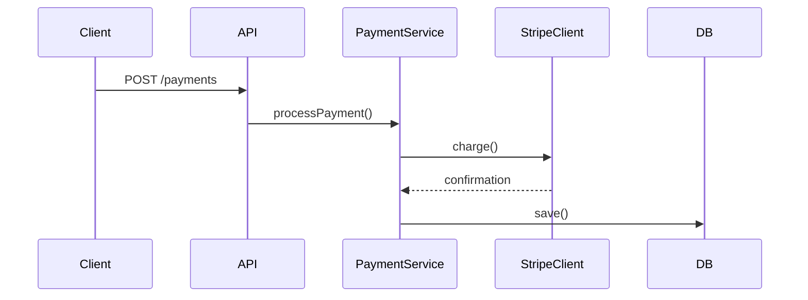
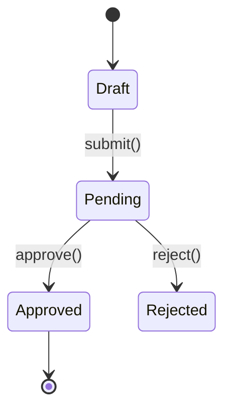

# Create Pull Request

Draft a concise and descriptive title and a short paragraph for a PR. Explain the purpose of the changes, the problem they solve, and the general approach taken. When the changes involve clear runtime flows or state transitions, include Mermaid diagrams.

## Process

1. If git is in a feature branch, examine all commit messages and the full diff to understand the overall changes
2. Analyze the diff for diagram opportunities (see Diagrams section below)
3. Draft a title and description, embedding any diagrams in the body
4. Output the drafted title and description as chat text so the user can review it
5. Use `AskUserQuestion` for confirmation only
6. Create the PR with `gh pr create`

## Diagrams

GitHub renders Mermaid natively in PR descriptions via ` ```mermaid ` code blocks. Include diagrams only when they add clarity a text description can't — skip for trivial changes or obvious flows.

### Sequence Diagram

Include when the changes introduce or modify a clear runtime flow: API endpoints, event handlers, pipelines, multi-service interactions, webhook flows.

````markdown

````

### State Diagram

Include when the changes add or modify entity states, status enums, workflow transitions, or lifecycle hooks.

````markdown

````

### Rules

- Only include when the diagram genuinely adds clarity
- Keep diagrams focused — max ~10 nodes/transitions
- Use descriptive labels on arrows (method names, HTTP verbs)
- Place diagrams after the summary paragraph under a `## Flow` or `## State Machine` heading
- One diagram per type max — don't include both unless the PR truly has both patterns
