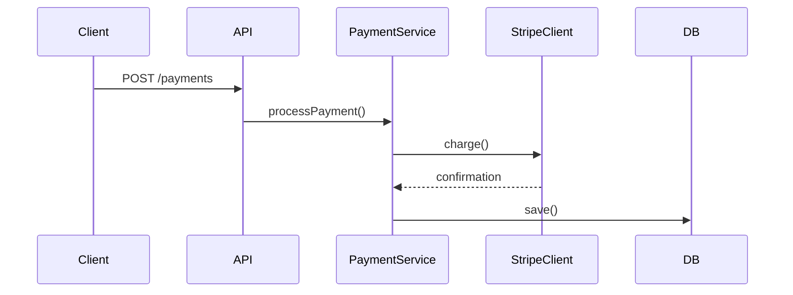
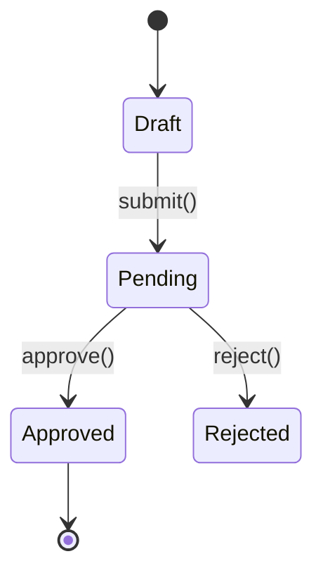

# Update PR Title and Description

Read the current PR title and body, analyze what changed in the session, and draft an updated title and description that preserves the original writing style.

## Step 1: Fetch Current PR

Fetch the current PR details:

```bash
gh pr view [PR_NUMBER] --json number,title,body,baseRefName,headRefName,updatedAt,commits
```

Omit PR_NUMBER to auto-detect from current branch.

## Step 2: Analyze the Existing Style

Before drafting, study the current title and body to identify:

- **Title format** — length, prefix conventions (e.g., `feat:`, `fix:`), capitalization
- **Body structure** — headings, bullet points, sections, line length
- **Tone** — formal vs. casual, terse vs. detailed
- **Content patterns** — does it explain the "why", list changes, include test plans?
- **Diagrams** — does the body contain Mermaid code blocks (sequence, state, or other)?

## Step 3: Evaluate Whether an Update Is Needed

Use the PR's `updatedAt` field and commit timestamps to determine whether new commits were added since the body was last edited.

If `commits_since_body_change` is empty, the description is already up to date — say so and stop.

If there are commits since the last body change, check the incremental diff to assess significance:

```bash
git diff origin/<base>...HEAD --diff-filter=d --stat -- $(git diff --name-only --since="<body_last_changed>" origin/<base>..HEAD)
```

Skip the update if the incremental changes are trivial (formatting, typos, config-only). Proceed if they add, remove, or modify meaningful behavior.

## Step 4: Analyze the Full Diff

Derive the PR description from the full diff, not from individual commits. The description should reflect the net change — what the code looks like now vs. the base — not the development journey. Intermediate bug fixes, reverted approaches, and implementation pivots that happened during development are not relevant to the reader.

1. Check `git diff origin/<base>...HEAD` for the full scope of changes — this is the primary source of truth
2. Use the incremental diff (since last body edit) to understand what's new, but frame everything in the context of the whole PR
3. Check if the changes introduce runtime flows or state transitions that warrant diagrams (see Diagrams section below)

## Step 5: Draft Updated Title and Description

Write an updated title and body that:

- **Matches the original style** — same structure, tone, formatting, and level of detail
- **Reflects the net change** — describe what the full diff shows, not the development history
- **Preserves what still applies** — keep existing text that remains accurate
- **Adds what's new** — integrate new changes naturally into the existing structure
- **Removes what's stale** — drop descriptions of work that was reverted or replaced
- **Updates diagrams** — if existing Mermaid diagrams are present, update them to reflect the current state; if they describe reverted code, remove them; if new changes warrant diagrams, add them

## Step 6: Confirm with User

Use `AskUserQuestion` to present the drafted title and description side-by-side with the original. Show what changed.

## Step 7: Apply the Update

After confirmation, update the PR:

```bash
gh pr edit <PR_NUMBER> --title "<TITLE>" --body "$(cat <<'EOF'
<BODY CONTENT HERE>
EOF
)"
```

## Diagrams

GitHub renders Mermaid natively in PR descriptions via ` ```mermaid ` code blocks. Include diagrams only when they add clarity a text description can't.

### Sequence Diagram

Include when the changes introduce or modify a clear runtime flow: API endpoints, event handlers, pipelines, multi-service interactions, webhook flows.

````markdown

````

### State Diagram

Include when the changes add or modify entity states, status enums, workflow transitions, or lifecycle hooks.

````markdown

````

### Rules

- Keep diagrams focused — max ~10 nodes/transitions
- Use descriptive labels on arrows (method names, HTTP verbs)
- Place diagrams after the summary paragraph under a `## Flow` or `## State Machine` heading
- One diagram per type max — don't include both unless the PR truly has both patterns

## Rules

- If the existing body is empty or minimal, infer a style from the title and commit messages
- Keep titles under 72 characters
- Preserve any existing sections the user clearly cares about (test plans, checklists, links)
